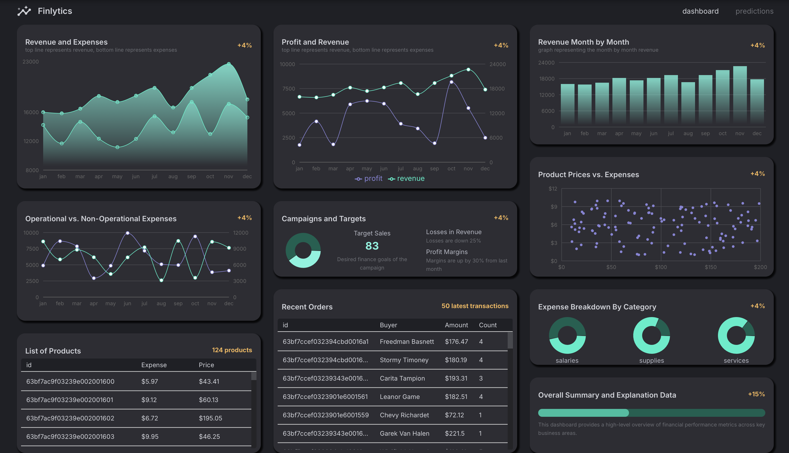

# Finlytics Dashboard

📊 A full-stack finance analytics tracker with machine learning–powered predictions and real-time visualizations.  
🌐 Live Site: [finlytics-dashboard.vercel.app](https://finlytics-dashboard.vercel.app)

---



---

## 🧠 Overview

Finlytics Dashboard is a modern web app that lets users analyze and track financial trends using AI-powered forecasts. The platform integrates backend data processing, machine learning models, and a sleek frontend dashboard to deliver actionable insights.

---

## 🛠️ Tech Stack

**Frontend**
- **React** with **Vite** for fast build times and dev experience
- **Recharts** for interactive and responsive data visualizations
- **Material UI (MUI)** for component styling and theme management
- **Custom Components** (e.g., `DashboardBox`, `BoxHeader`, `FlexBetween`) for a reusable, grid-based layout system
- Deployed on **Vercel**

**Backend**
- **Express.js** for RESTful API creation
- **Mongoose** for MongoDB schema modeling and data transformation (currency parsing, getters)
- **MongoDB Atlas** as the cloud database for storing financial data and KPIs
- Deployed on **Fly.io**

**Machine Learning**
- **Regression.js** (simple linear regression via `regression` library) to model and predict future revenue
- **useMemo** hooks in React to compute derived state from API data efficiently

**Database**
- Uses **MongoDB Atlas** for flexible document storage and quick query performance  

---

## 📁 Project Structure

```bash
finlytics-dashboard/
├── client/
│   ├── public/
│   └── src/
│       ├── assets/
│       ├── components/
│       ├── scenes/
│       └── state/
├── server/
│   ├── data/
│   ├── models/
│   └── routes/
└── README.md
```

## 🔐 Environment Variables

This project uses environment variables to manage sensitive configuration details. These files are included in `.gitignore` and are **not** tracked by version control. To run the project locally, you'll need to create the following `.env` files:

---

### 📦 Client Side

Create a `.env.local` file in the `client/` folder with the following content:

```env
VITE_BASE_URL=<your_fly_io_hostname>
```

### 🛠️ Server Side

Create a `.env` file in the `server/` folder with the following content:

```env
PORT=8080
MONGO_URL=<your_mongodb_connection_string>
```